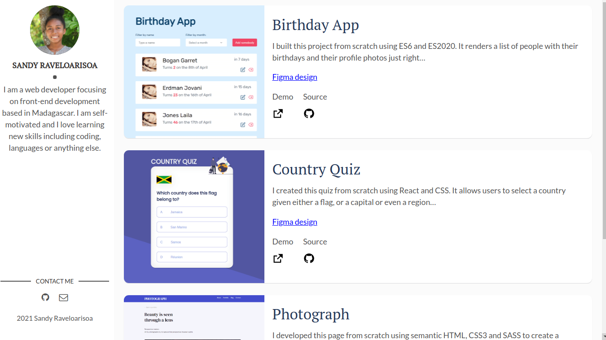
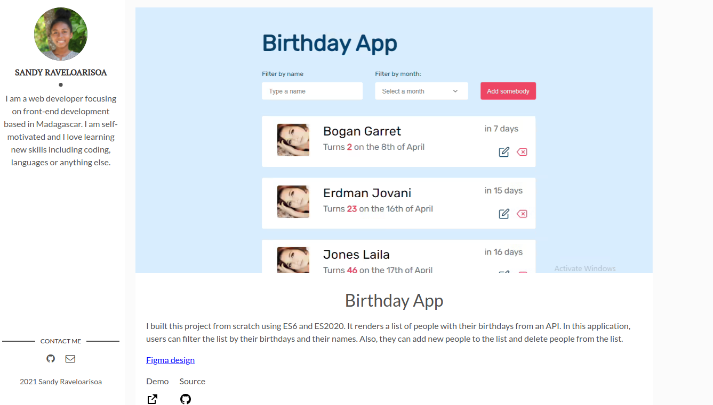

<h1 align="center">
  Sandy Portfolio
</h1>

<div align="center">
  <h3>
    <a href="https://github.com/Voninkazo/React-Native-learn-Malagasy-English">
      Source
    </a>
    <span> | </span>
    <a href="https://play.google.com/store/apps/details?id=com.learngasy&hl=en&gl=US">
      Demo
    </a>
  </h3>
</div>

This portfolio is build with template from gatsby Contents including texts and images are changed.

Just right below, you can see a screenshot of this page and a list of several projects.

You can find a link to the demo and a link to the github source just right under each project.




    ## Quick Start 🚀

1.  **Create a Gatsby site.**
    Use the Gatsby CLI to create a new site, specifying the default starter.
    ```sh
    # create a new Gatsby site using the-plain-gatsby starter
    gatsby new portfolio-gatsby https://github.com/Voninkazo/portfolio-gatsby
    ```
2.  **Start developing.**
    Navigate into your new site's directory and start it up.
    ```sh
    cd portfolio-gatsby/
    gatsby develop
    ```
3.  **Open the source code and start editing!**
    Your site is now running at `http://localhost:8000`!
    _Note: You'll also see a second link: _`http://localhost:8000/___graphql`_. This is a tool you can use to experiment with querying your data. Learn more about using this tool in the [Gatsby tutorial](https://www.gatsbyjs.org/tutorial/part-five/#introducing-graphiql)._

## Contact

Github [Voninkazo](https://github.com/Voninkazo)
The portfolio based on https://github.com/wangonya/flexible-gatsby
